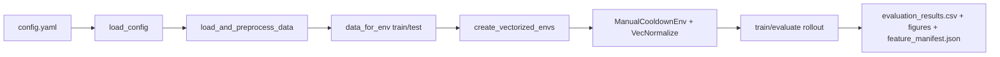

# Data Flow Analysis

## High-Level Pipeline

## Core Configuration Inputs

- `environment.observation_schema`: `instant | history | forecast | hybrid`
- `environment.forecast_horizon`: lookahead index used by forecast schemas
- `environment.window_size`: historical window length for history/hybrid
- `environment.use_*_features`: optional feature banks
- `reward`: SEC-only parameters (`sec_scale`, `qos_lambda`, switching/scaling costs)

## Preprocessing Flow (`utils.load_and_preprocess_data`)

1. Load traffic series from CSV.
2. Optionally load forecast series (required for `forecast`/`hybrid`).
3. Align train/test splits for traffic, forecast, and calendar arrays.
4. Build predictor sources:
   - `precompute`: `dpdk_lookup` and `oai_lookup`
   - `runtime`: `dpdk_bundle` and `oai_bundle`
5. Compute optional feature banks:
   - dynamics (`dT`, moving stats, EMA)
   - capacity margins
   - power gaps
   - calendar sin/cos
6. Return `data_for_env = {train: {...}, test: {...}}`.

## Environment Input Payload

Each split contains:

- `traffic_data`
- one of lookup/bundle predictor sources
- optional `forecast_data`
- optional `extra_features`, `capacity_features`, `calendar_features`
- optional `calendar_features_forecast`

## Observation Construction (`environment.py`)

Base observation by schema:

- `instant`: `traffic[t] + config + cooldown`
- `history`: `traffic[t-W+1:t] + config + cooldown`
- `forecast`: `forecast[t+H] + config + cooldown`
- `hybrid`: `history + forecast[t+H] + config + cooldown`

Then append enabled feature banks in fixed order:

1. dynamics
2. capacity margins
3. power gaps
4. calendar (aligned to `t` for instant/history, `t+H` for forecast/hybrid)

## Step-Time Flow (`env.step`)

1. Receive policy action at step `t`.
2. Apply cooldown gating (may keep previous config).
3. Predict performance/power for executed config using current traffic.
4. Compute SEC and penalties.
5. Compute reward:
   - `reward = -sec_scale * sec - type_switch_penalty - scale_penalty - qos_penalty`
6. Advance timestep and emit `(obs, reward, terminated, truncated, info)`.

## Evaluation Flow (`evaluate.py`)

1. Load model + VecNormalize stats.
2. Roll out test episode and collect `info` rows.
3. Save:
   - `evaluation_results_*.csv`
   - `timeline_*.csv`
   - `feature_manifest.json`
   - plots in `figures/`
4. Compute static baselines (Always-DPDK and Always-k×OAI).

## Info Fields (Key)

- core: `traffic`, `power`, `performance`, `reward`, `sec`
- actions: `requested_action`, `executed_action`, `cooldown_blocked`
- penalties: `type_switch_penalty`, `scale_penalty`, `qos_penalty`
- metadata: `obs_len`, `window_size`, optional bank snapshots
