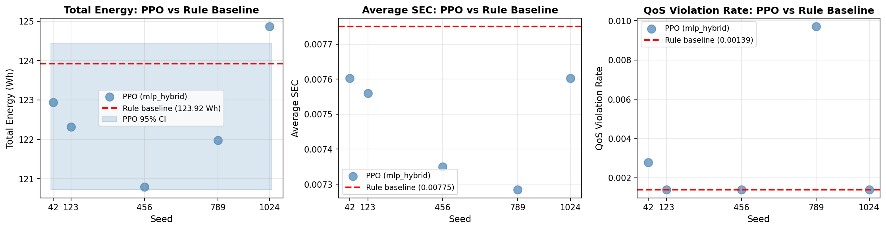

# Wilcoxon Signed-Rank Test Report
**PPO (mlp_hybrid) vs Rule-based Baseline — Total Energy**

- **Date:** 2026-03-20
- **Model:** PPO feed-forward (`mlp_hybrid`), selected as the main-paper variant
- **Metric (primary):** `total_energy_wh`
- **Source files:**
  - PPO seeds: `experiments/results/B2_top2_seeds/b2_two_model_per_seed_comparison.csv`
  - Baseline: `experiments/results/paper_results_assets/tab_overall_results.csv`

---

## Section A — Raw Values

| Seed | PPO Energy (Wh) | Diff vs Rule (Wh) | Direction |
|------|----------------:|------------------:|-----------|
| seed_42 | 122.9344 | −0.9889 | BETTER |
| seed_123 | 122.3208 | −1.6026 | BETTER |
| seed_456 | 120.7900 | −3.1333 | BETTER |
| seed_789 | 121.9785 | −1.9448 | BETTER |
| seed_1024 | 124.8696 | +0.9463 | WORSE |

**Rule-based baseline: 123.9233 Wh**

---

## Section B — Descriptive Statistics (PPO, n=5)

| Statistic | Value |
|-----------|-------|
| Mean ± std | 122.58 ± 1.50 Wh |
| Median | 122.32 Wh |
| Min / Max | 120.79 / 124.87 Wh |
| 95% CI (t-distribution) | [120.72, 124.44] Wh |
| Mean difference (PPO − Rule) | −1.34 ± 1.50 Wh |
| 95% CI of mean difference | [−3.21, +0.52] Wh |
| Median difference | −1.60 Wh |
| Seeds outperforming rule | **4 / 5** |

---

## Section C — Wilcoxon Signed-Rank Test

One-sample test against the fixed rule-based baseline value (`zero_method='wilcox'`, two-tailed).

| | |
|--|--|
| Test statistic W | **1.0** |
| p-value (two-tailed) | **0.1250** |
| n_negative (PPO < rule, i.e. better) | 4 |
| n_positive (PPO > rule, i.e. worse) | 1 |
| Ties | 0 |
| Significant at α = 0.05 | **No** |
| Significant at α = 0.05 / 3 (Bonferroni) | **No** |

> **Note:** With n=5, the minimum achievable two-sided p-value for the Wilcoxon test is 0.0625 (all differences in the same direction). The observed p=0.1250 reflects the one outlier seed (seed_1024) that performed worse than the baseline.

---

## Section D — Secondary Metrics

| Metric | PPO Mean | Rule | W | p-value | Significant |
|--------|----------|------|---|---------|-------------|
| avg_SEC | 0.007480 | 0.007751 | 0.0 | 0.0625 | No |
| qos_violation_rate | 0.003329 | 0.001389 | 6.0 | 0.8125 | No |

---

## Section E — Paper-ready Statements

**[1] Statistical test description:**

> We compared the total energy consumption of PPO (feed-forward, `mlp_hybrid`) against the deterministic rule-based baseline (123.92 Wh) using a one-sample Wilcoxon signed-rank test across 5 independent random seeds. The median per-seed difference was −1.60 Wh (mean: −1.34 ± 1.50 Wh), with test statistic W = 1 and p = 0.125.

**[2] Interpretation (conservative):**

> No statistically significant difference was detected between PPO (mean 122.58 Wh) and the rule-based baseline (123.92 Wh) at α = 0.05 (p = 0.125, n = 5). While 4 out of 5 seeds produced lower energy than the baseline, the small sample size (n = 5) severely limits statistical power — the minimum achievable p-value with this test and sample size is 0.0625 — and results should therefore be interpreted with caution.

---

## Section F — Plot

*Per-seed PPO energy (blue dots) vs rule-based baseline (red dashed line). The PPO 95% CI band is shown in light blue.*

---

## Appendix — Analysis Script

Full analysis: `experiments/results/paper_results_assets/wilcoxon_analysis.py`
